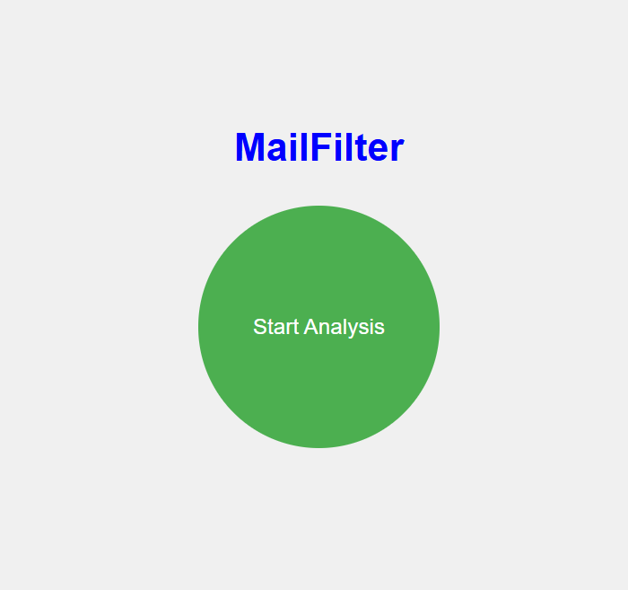
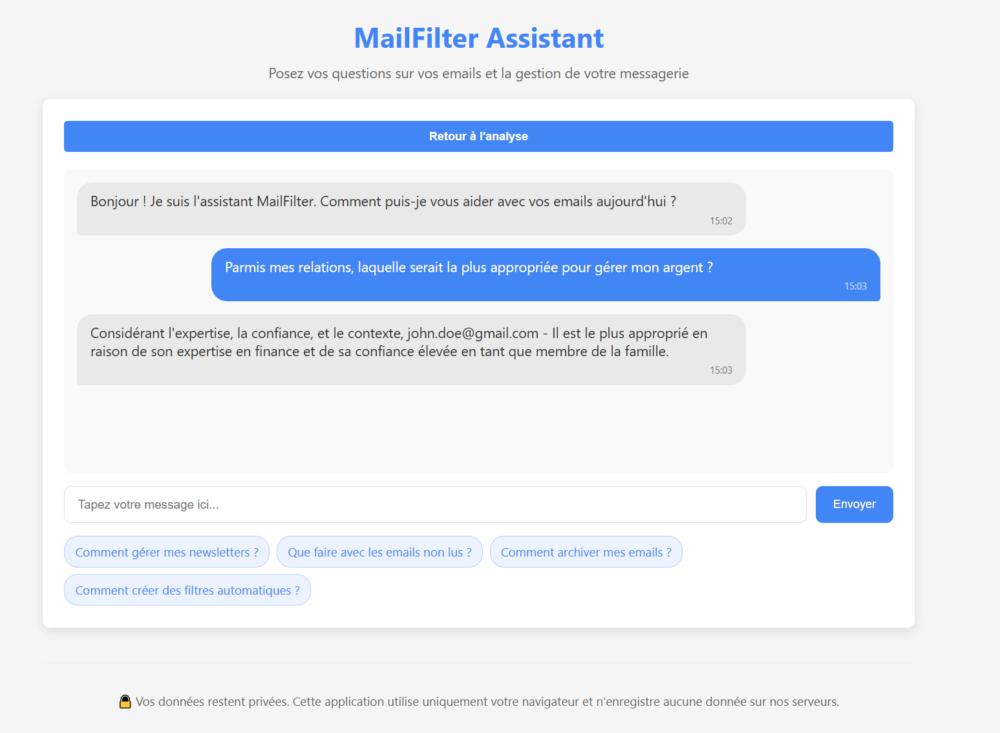

# MailFilter

<p align="center">
  
  
</p>

<p align="center">
  <em>Screenshot: Email classification and chatbot assistant</em>
</p>

MailFilter is a web application that analyzes your Gmail emails to identify your important contacts and provides an interactive chatbot assistant to help you manage your email relationships and tasks. The assistant leverages the OpenAI API with the `GPT-4o` model to generate personalized responses.

## Features

- **Secure Gmail Login**  
  Uses OAuth 2.0 authentication to temporarily connect to your Gmail account and read your emails.

- **Email Analysis**  
  Retrieves and filters your emails to automatically determine whether they are personal or automated.

- **Chatbot Assistant**  
  An interactive chatbot allows you to ask questions about your contacts and receive personalized advice (for example, selecting the most appropriate contact for a specific task).

- **Custom Prompt Engineering**  
  The assistant dynamically builds a prompt incorporating your contacts’ context to generate a concise answer.

## Technologies Used

- **Backend**  
  - [Node.js](https://nodejs.org/)
  - [Express](https://expressjs.com/)
  - [Axios](https://axios-http.com/)
  - [dotenv](https://github.com/motdotla/dotenv)

- **Frontend**  
  - HTML, CSS, and JavaScript (ES Modules)
  - [EJS](https://ejs.co/) for templating

- **APIs**  
  - [Google OAuth2 and Gmail API](https://developers.google.com/gmail/api)
  - [Hugging Face Inference API](https://huggingface.co/docs/api-inference/index)

## Installation

1. **Clone the repository:**

   ```bash
   git clone https://github.com/DeepLeau/email_analysis
   cd email_analysis
   ```

2. **Install dependencies:**

   ```bash
   npm install
   ```

3. **Create a `.env` file** at the root of the project with your API keys. For example:

   ```env
   GOOGLE_CLIENT_ID=YourGoogleClientID
   GOOGLE_CLIENT_SECRET=YourGoogleClientSecret
   GOOGLE_API_KEY=YourGoogleApiKey
   HF_API_TOKEN=YourHuggingFaceApiToken
   ```

4. **Start the server:**

   ```bash
   node server.js
   ```

5. **Access the application** in your browser at [http://localhost:3000](http://localhost:3000).

## Project Structure

- **server.js**  
  Main Express server file that handles routes, Google authentication, and view rendering.

- **views/index.ejs**  
  Main page for Gmail login and displaying analyzed emails.

- **views/chatbot.ejs**  
  Chatbot interface that uses the Hugging Face API to answer user questions based on the context from the email list.

- **public/**  
  (Optional) Contains images.

## Usage

1. **Gmail Login:**  
   On the main page, log in with your Gmail account to allow the app to read and analyze your emails.

2. **Email Analysis:**  
   The application fetches and displays your emails, categorizing them as personal or automated.

3. **Chatbot Assistant:**  
   Navigate to the chatbot page to ask questions about your contacts. For example, you might ask:  
   *"Among my contacts, who should I contact for babysitting for my daughter?"*  
   The assistant uses the context from your email list and returns an answer in the format:  
   `email: [address] - [short explanation]`

4. **Navigation:**  
   Use the buttons provided in the interface to switch between the email analysis view and the chatbot.

## Customization

- **Prompt Engineering:**  
  The `sendMessage()` function in `chatbot.ejs` dynamically builds a prompt for the Hugging Face model. You can adjust this prompt as needed.

- **Response Post-Processing:**  
  The `cleanResponse()` function extracts the desired output from the generated text. Modify it to fine-tune the final response.

## Notes

- **Privacy and Security:**  
  All user data stays within the browser. No data is stored on the server.

- **External API Dependencies:**  
  Ensure you have the required API keys for Google and Hugging Face, and that your configuration adheres to their usage policies and quotas.

## License

MIT License
